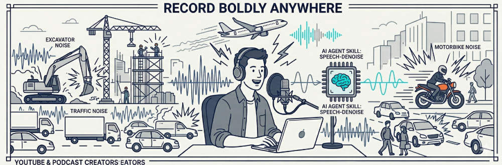

<div align="center">



# Speech & Vocal Skills

**Your voice recordings, now noise-free.**

Recorded in a noisy apartment? Your preamp humming? Plane flying overhead?
This skill fixes it. Denoise audio in seconds - runs on Modal L4 GPU and FREE.

Built for ourselves. Open to everyone.

🇺🇸 [English](README.md) | 🇨🇳 [简体中文](README_CN.md) | 🇹🇼 [繁體中文](README_TW.md)

</div>

---

## 🎤 speech-denoise

Your audio sounds perfect. Except for the background noise.

Whether it's an air conditioner hum, street traffic, electrical interference, or that mysterious buzz your preamp won't stop making - run the skill, get clean audio back.

Works with any format: `.m4a`, `.mp3`, `.mp4`, `.wav`, `.flac`, `.ogg`, `.aac`, `.mov`, `.avi`.

Just tell your AI agent:
```bash
denoise these files: /path/to/file1, /path/to/file2...
```

No audio editing skills required.

---

## 📦 Installation

```bash
npx skills add speech2srt/skills
```

For OpenClaw, just tell your agent: `install speech-denoise skill` or `install speech-isolate skill`.

---

## One more thing...

**🎵 speech-isolate** - Extract vocals from any audio track.

Got a music track and want the isolated vocals? Or the instrumental? That's this skill.

> **Tip:** Use this before ASR. Background music confuses speech recognition models - remove it first, get cleaner transcripts.

---

## 🚀 Performance

**L4 GPU on Modal - real-world benchmarks:**

| Skill | Audio Duration | GPU Time | Wall Time | RTF |
|-------|----------------|----------|-----------|-----|
| speech-denoise | ~17 min (2 files) | 48s | 80s | 0.08x |
| speech-isolate | ~6 min (1 file) | 30s | 36s | 0.09x |

Modal [L4 GPU](https://modal.com/pricing) runs $0.80/hr, but they give **$30 free credits monthly** - that's 37 hours of L4 GPU time. Even at a conservative RTF of 0.1x, **you can process 370+ hours of audio for ZERO dollars**. More than enough for a solo creator or a small studio.

---

## 🙏 Acknowledgments

- [Modal](https://modal.com) - GPU cloud infrastructure
- [ClearerVoice-Studio](https://huggingface.co/samson-castalk/ClearerVoice-Studio) - speech enhancement toolkit (MossFormer2 model)
- [Demucs](https://github.com/facebookresearch/demucs) - music source separation (htdemucs_ft model)
- [skills.sh](https://skills.sh) - open agent skills ecosystem
- [ClawHub](https://clawhub.ai) - OpenClaw skills distribution platform

---

## 🔧 Development

See [DEVELOPMENT.md](DEVELOPMENT.md) for details.
